---
## Front matter
title: "Лабораторная работа 1"
subtitle: "Установка и конфигурация ОС на виртуальную машину"
author: "Безнощук Владимир Юрьевич"

## Generic otions
lang: ru-RU
toc-title: "Содержание"

## Bibliography
bibliography: bib/cite.bib
csl: pandoc/csl/gost-r-7-0-5-2008-numeric.csl

## Pdf output format
toc: true # Table of contents
toc-depth: 2
lof: true # List of figures
lot: true # List of tables
fontsize: 12pt
linestretch: 1.5
papersize: a4
documentclass: scrreprt
## I18n polyglossia
polyglossia-lang:
  name: russian
  options:
	- spelling=modern
	- babelshorthands=true
polyglossia-otherlangs:
  name: english
## I18n babel
babel-lang: russian
babel-otherlangs: english
## Fonts
mainfont: PT Serif
romanfont: PT Serif
sansfont: PT Sans
monofont: PT Mono
mainfontoptions: Ligatures=TeX
romanfontoptions: Ligatures=TeX
sansfontoptions: Ligatures=TeX,Scale=MatchLowercase
monofontoptions: Scale=MatchLowercase,Scale=0.9
## Biblatex
biblatex: true
biblio-style: "gost-numeric"
biblatexoptions:
  - parentracker=true
  - backend=biber
  - hyperref=auto
  - language=auto
  - autolang=other*
  - citestyle=gost-numeric
## Pandoc-crossref LaTeX customization
figureTitle: "Рис."
tableTitle: "Таблица"
listingTitle: "Листинг"
lofTitle: "Список иллюстраций"
lotTitle: "Список таблиц"
lolTitle: "Листинги"
## Misc options
indent: true
header-includes:
  - \usepackage{indentfirst}
  - \usepackage{float} # keep figures where there are in the text
  - \floatplacement{figure}{H} # keep figures where there are in the text
---

# Цель работы

Целью данной работы является приобретение практических навыков установки операционной системы на виртуальную машину, настройки минимально необходимых для дальнейшей работы сервисов.

# Указание к работе

Техническое обеспечение

Лабораторная работа подразумевает установку на виртуальную машину VirtualBox (https://www.virtualbox.org/) операционной системы Linux (дистрибутив Fedora).
Выполнение работы возможно как в дисплейном классе факультета физико-математических и естественных наук РУДН, так и дома. Описание выполнения работы приведено для дисплейного класса со следующими характеристиками техники:
Intel Core i3-550 3.2 GHz, 4 GB оперативной памяти, 80 GB свободного места на жёстком диске;
ОС Linux Gentoo (http://www.gentoo.ru/);
VirtualBox версии 7.0 или новее.
Для установки в виртуальную машину используется дистрибутив Linux Fedora (https://getfedora.org), вариант с менеджером окон i3 (https://spins.fedoraproject.org/i3/).
При выполнении лабораторной работы на своей технике вам необходимо скачать необходимый образ операционной системы (https://spins.fedoraproject.org/i3/download/index.html).

# Выполнение лабораторной работы

1. Обновить все пакеты (рис. @fig:001).

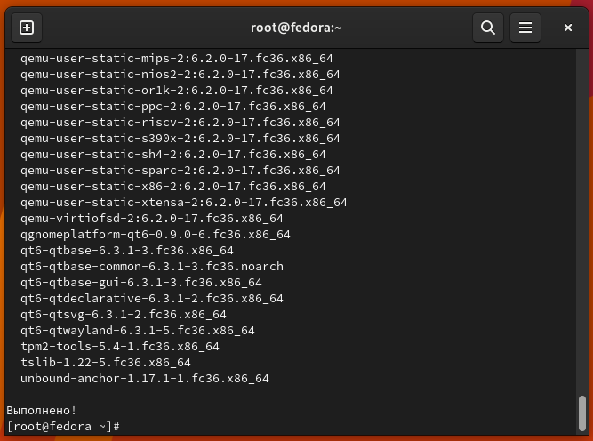{ #fig:001 width=70% }

# Повышение комфорта работы

2. Программы для удобства работы в консоли (рис. @fig:002).

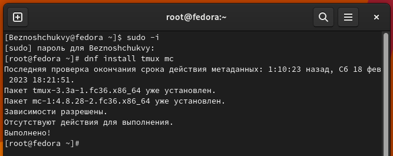{ #fig:002 width=70% }

# Автоматическое обновление 

3. При необходимости можно использовать автоматическое обновление.

4. Установка программного обеспечения (рис. @fig:003).

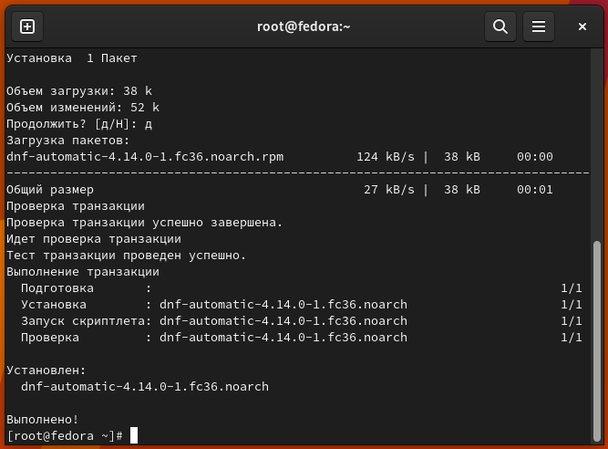{ #fig:003 width=70% }

5. Задаёте необходимую конфигурацию в файле /etc/dnf/automatic.conf.

6. Запустите таймер (рис. @fig:004).

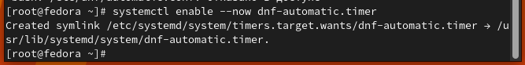{ #fig:004 width=70% }

7. В данном курсе мы не будем рассматривать работу с системой безопасности SELinux.
Поэтому отключим его.

8. В файле /etc/selinux/config замените значение (рис. @fig:005).

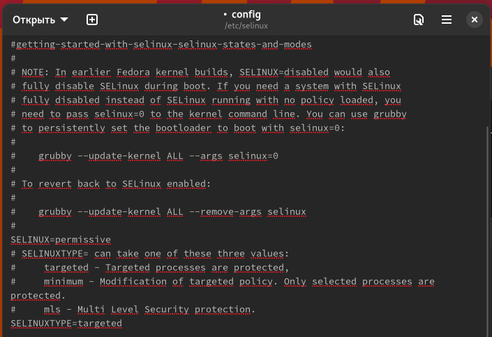{ #fig:005 width=70% }

9. Войдите в ОС под заданной вами при установке учётной записью.

10. Нажмите комбинацию Win+Enter для запуска терминала.

11. Запустите терминальный мультиплексор tmux и переключитесь на роль супер-пользователя

12. Установите пакет DKMS (рис. @fig:006).

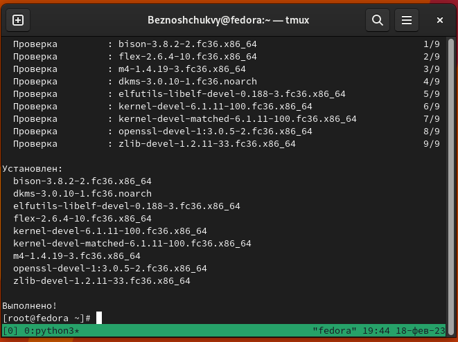{ #fig:006 width=70% }

13. В меню виртуальной машины подключите образ диска дополнений гостевой ОС.

14. Подмонтируйте диск (рис. @fig:007).

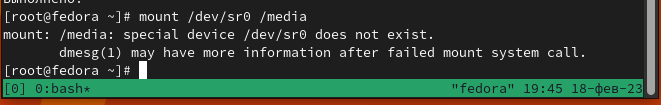{ #fig:007 width=70% }

15. Войдите в ОС под заданной вами при установке учётной записью.

16. Нажмите комбинацию Win+Enter для запуска терминала.

17. Запустите терминальный мультиплексор tmux.

18. Переключитесь на роль супер-пользователя.

19. Отредактируйте конфигурационный файл /etc/X11/xorg.conf.d/00-keyboard.conf (рис. @fig:008).

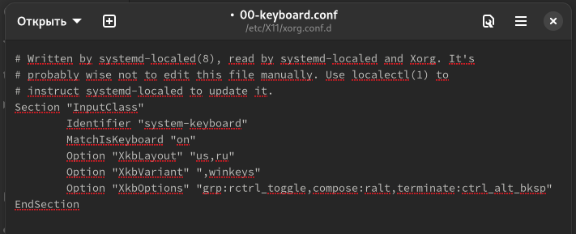{ #fig:008 width=70% }

20. Установим pandoc и необходимые расширения (рис. @fig:009).

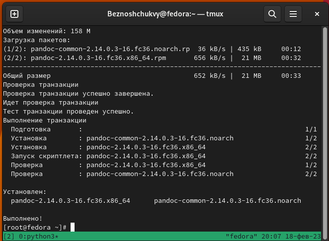{ #fig:009 width=70% }

21. Установим дистрибутив TeXlive (рис. @fig:010).

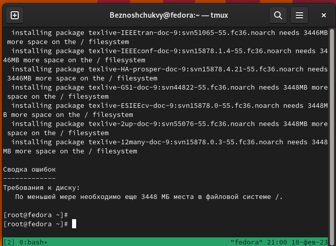{ #fig:010 width=70% }

# Домашняя работа (рис. @fig:011) (рис. @fig:012).

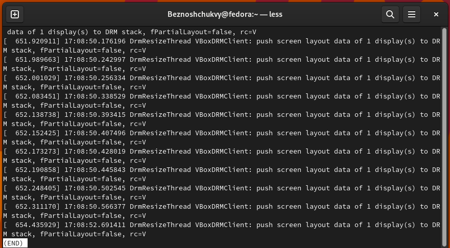{ #fig:011 width=70% }

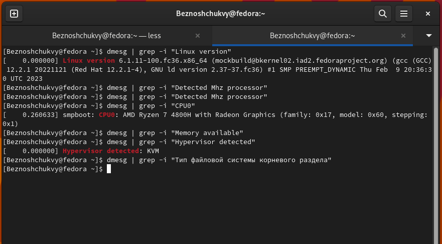{ #fig:012 width=70% }

# Выводы

Мы приобрели практические навыки установки ОС на виртуальную машину, приобрели начальные навыки в настройке минимально необходимых для дальнейших работ сервисов.

# Список литературы{.unnumbered}

::: {#refs}
:::
