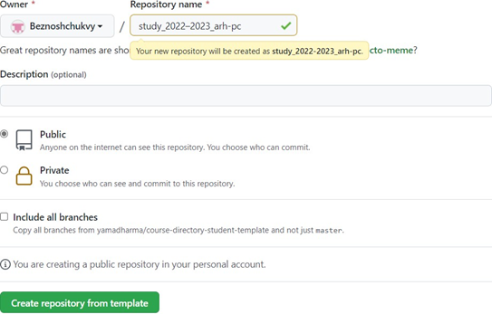

---
## Front matter
title: "Отчет по лабораторной работе № 3"
subtitle: "НКАбд-04-22"
author: "Безнощук Владимир Юрьевич"

## Generic otions
lang: ru-RU
toc-title: "Содержание"

## Bibliography
bibliography: bib/cite.bib
csl: pandoc/csl/gost-r-7-0-5-2008-numeric.csl

## Pdf output format
toc: true # Table of contents
toc-depth: 2
lof: true # List of figures
fontsize: 12pt
linestretch: 1.5
papersize: a4
documentclass: scrreprt
## I18n polyglossia
polyglossia-lang:
  name: russian
  options:
  - spelling=modern
  - babelshorthands=true
polyglossia-otherlangs:
  name: english
## I18n babel
babel-lang: russian
babel-otherlangs: english
## Fonts
mainfont: PT Serif
romanfont: PT Serif
sansfont: PT Sans
monofont: PT Mono
mainfontoptions: Ligatures=TeX
romanfontoptions: Ligatures=TeX
sansfontoptions: Ligatures=TeX,Scale=MatchLowercase
monofontoptions: Scale=MatchLowercase,Scale=0.9
## Biblatex
biblatex: true
biblio-style: "gost-numeric"
biblatexoptions:
  - parentracker=true
  - backend=biber
  - hyperref=auto
  - language=auto
  - autolang=other*
  - citestyle=gost-numeric
## Pandoc-crossref LaTeX customization
figureTitle: "Рис."
tableTitle: "Таблица"
listingTitle: "Листинг"
lofTitle: "Список иллюстраций"
lolTitle: "Листинги"
## Misc options
indent: true
header-includes:
  - \usepackage{indentfirst}
  - \usepackage{float} # keep figures where there are in the text
  - \floatplacement{figure}{H} # keep figures where there are in the text
---

# Цель работы

Целью работы является изучить идеологию и применение cредств контроля версий. Приобрести практические навыки по работе с системой git.

# Теоретическое введение

Системы контроля версий (Version Control System, VCS) -Программное
обеспечение для облегчения работы с изменяющейся информацией. Система
управления версиями позволяет хранить несколько версий одного и того же
документа, при необходимости возвращаться к более ранним версиям,определять, кто и когда сделал то или иное изменение, и многое другое. 

VCS Git – распределённая система контроля версий. Она представляет собой набор программ командной строки. Доступ к ним можно получить из терминала
посредством ввода команды git с различными опциями. Благодаря тому, что Git является распределённой системой контроля версий, резервную копию локального хранилища можно сделать простым копированием или архивацией.

# Выполнение лабораторной работы

## 1. Настройка github

{ #fig:001 width=70% }

## 2. Базовая настройка git

(предварительная конфигурация git, настройка utf-8 в выводе сообщений git,
зададим имя начальной ветки (будем называть её master), параметры autocrlf и safecrlf) 

{ #fig:003 width=70% }

## 3. Создание SSH ключа 

Генерируем ключ 

{ #fig:004 width=70% }

Копируем ключ

{ #fig:005 width=70% }

Загружаем готовый ключ на github

{ #fig:006 width=70% }

{ #fig:007 width=70% }

## 4. Создание рабочего пространства и репозитория курса на основе шаблона

Создаю каталог для предмета – Архитектура компьютера

{ #fig:009 width=70% }

## 5. Сознание репозитория курса на основе шаблона

Создаю репозиторий по шаблону курса

{ #fig:010 width=70% }

{ #fig:011 width=70% }

Клонирую созданный репозиторий

{ #fig:012 width=70% }

## 6. Настройка каталога курса
 
Переходим в каталог курса, удаляем не нужные файлы, добавляем нужные каталоги и отправляем файлы на сервер.

{ #fig:013 width=70% }

{ #fig:014 width=70% }

Проверяем правильность создания иерархии рабочего пространства

{ #fig:015 width=70% }

{ #fig:016 width=70% }

## Задание для самостоятельной работы

Создадим отчет по выполнению лабораторной работы в соответствующем каталоге рабочего пространства (labs>lab03>report)

{ #fig:021 width=70% }

Загрузим файлы на github.

{ #fig:022 width=70% }

Ссылка на репозиторий: https://github.com/Beznoshchukvystudy_2022-2023_arh-pc
# Контрольные вопросы для самопроверки

1	Система управления версиями
Программное обеспечение для облегчения работы с изменяющейся информацией. Система управления версиями позволяет хранить несколько версий одного и того же документа, при необходимости возвращаться к более ранним версиям,
определять, кто и когда сделал то или иное изменение, и многое другое.
2	VCS. Version Control System (VCS)– система контроля версий. Из названия следует основной кейс применения таких систем – контроль версий систем. VCS сохраняет изменения, которые произошли от одной версии файла к другой. В качестве
систем могут быть файлы с кодом программ, скриптов или конфигурационные файлы (например, файлы конфигурации DHCP, файлы зон DNS, настроек iptables или apache).

# Выводы
Я изучил идеологию и применение средств в github и VCS Git.
Получил практический опыт в использовании этих инструментов.

