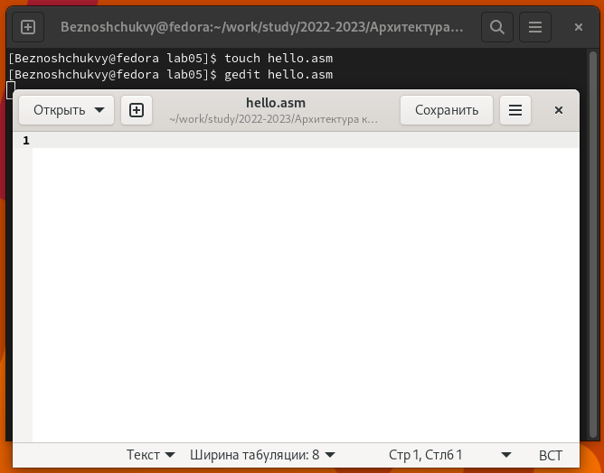
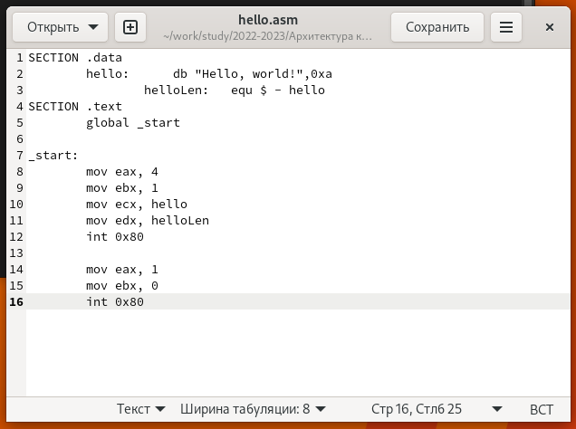
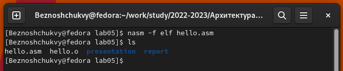
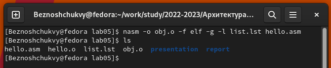
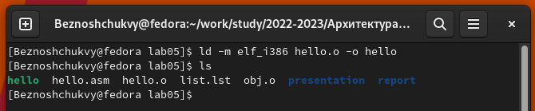
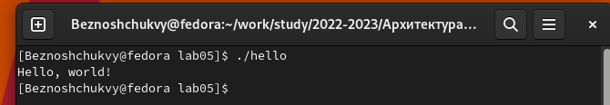
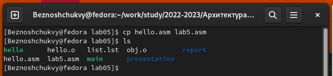
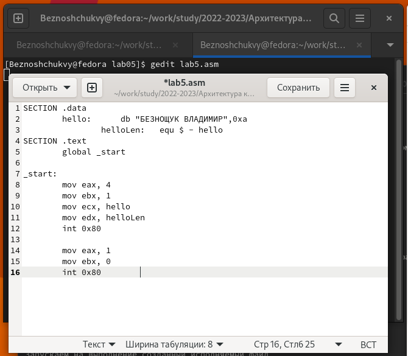
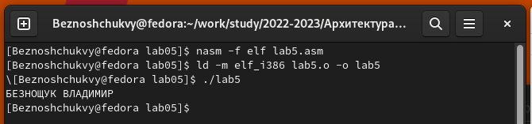
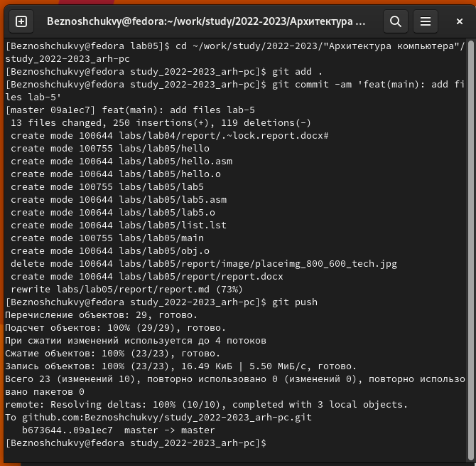

---
## Front matter
title: "Отчет по лабораторной работе № 5"
subtitle: "НКАбд-04-22"
author: "Безнощук Владимир Юрьевич"

## Bibliography
bibliography: bib/cite.bib
csl: pandoc/csl/gost-r-7-0-5-2008-numeric.csl

## I18n polyglossia
polyglossia-lang:
  name: russian
  options:
  - spelling=modern
  - babelshorthands=true
polyglossia-otherlangs:
  name: english
## I18n babel
babel-lang: russian
babel-otherlangs: english
## Fonts
mainfont: PT Serif
romanfont: PT Serif
sansfont: PT Sans
monofont: PT Mono
mainfontoptions: Ligatures=TeX
romanfontoptions: Ligatures=TeX
sansfontoptions: Ligatures=TeX,Scale=MatchLowercase
monofontoptions: Scale=MatchLowercase,Scale=0.9
## Biblatex
biblatex: true
biblio-style: "gost-numeric"
biblatexoptions:
  - parentracker=true
  - backend=biber
  - hyperref=auto
  - language=auto
  - autolang=other*
  - citestyle=gost-numeric
## Pandoc-crossref LaTeX customization
figureTitle: "Рис."
tableTitle: "Таблица"
listingTitle: "Листинг"
lofTitle: "Список иллюстраций"
lolTitle: "Листинги"
## Misc options
indent: true
header-includes:
  - \usepackage{indentfirst}
  - \usepackage{float} # keep figures where there are in the text
  - \floatplacement{figure}{H} # keep figures where there are in the text
---

# Цель работы

Целью работы является освоение процедуры компиляции и сборки программ, написанных на ассем-
блере NASM.

# Задание

1. Запустить команду "Hello world!" и в соответствующем каталоге сделать отчёт по лабораторной работе № 5 в формате Markdown.
2. В каталоге ~/work/arch-pc/lab05 с помощью команды cp создайте копию файла hello.asm с именем lab5.asm. С помощью любого текстового редактора внесите изменения в текст программы в файле lab5.asm так, чтобы вместо Hello world! на экран выводилась строка с вашими фамилией и именем. Оттранслируйте полученный текст программы lab5.asm в объектный файл. Выполните компоновку объектного файла и запустите получившийся исполняемый файл. Скопируйте файлы hello.asm и lab5.asm в Ваш локальный репозиторий в каталог ~/work/study/2022-2023/"Архитектура компьютера"/arch-pc/labs/lab05/. Загрузите файлы на Github.

# Выполнение лабораторной работы

## Программа Hello world!

Переходим в существующий каталог lab05 и создаем текстовый файл с именем hello.asm. Открываем этот файл с помощью любого текстового редактора, например, gedit.

{ #fig:001 width=70% }

Ввели в этот файл следующий текст.

{ #fig:002 width=70% }

## Транслятор NASM

С помощью NASM превращаем текст программы в объектный код.

{ #fig:006 width=70% }

## Расширенный синтаксис командной строки NASM

Компилирует исходный файл hello.asm в obj.o и проверяем созданный нами файл командой ls.

{ #fig:010 width=70% }

## Компоновщик LD

Передаем объектный файл на обработку компоновщику и проверяем созданный нами файл командой ls.

{ #fig:010 width=70% }

## Запуск исполняемого файла

Запускаем на выполнение созданный исполняемый файл

{ #fig:010 width=70% }

## Задание для самостоятельной работы

1. В каталоге ~/work/arch-pc/lab05 с помощью команды cp создали копию файла hello.asm с именем lab5.asm

{ #fig:021 width=70% }

2. С помощью текстового редактора gedit внесли изменения в текст программы в файле lab5.asm так, чтобы вместо Hello world! на экран выводилась строка с моими фамилией и именем.

{ #fig:023 width=70% }

3. Оттранслировали полученный текст программы lab5.asm в объектный файл, выполните компоновку объектного файла и запустите получившийся исполняемый файл.

{ #fig:023 width=70% }

3. Скопировали файлы hello.asm и lab5.asm в локальный репозиторий в каталог lab05 и загрузили файлы на Github.

{ #fig:023 width=70% }

# Выводы

В ходе лабораторной работы были освоены процедуры компиляции и сборки программ, написанных на ассемблере NASM.

